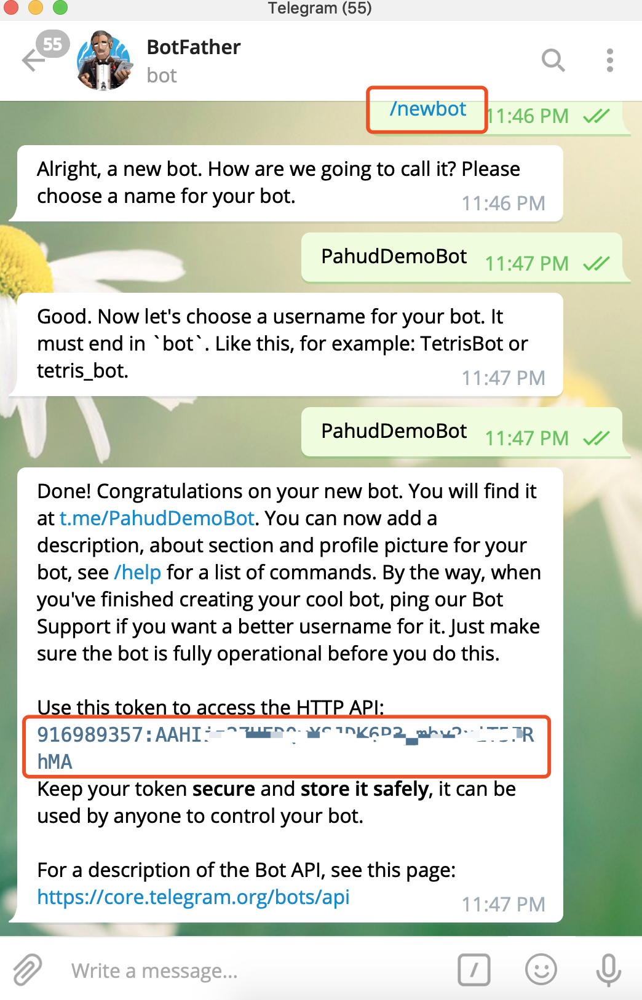
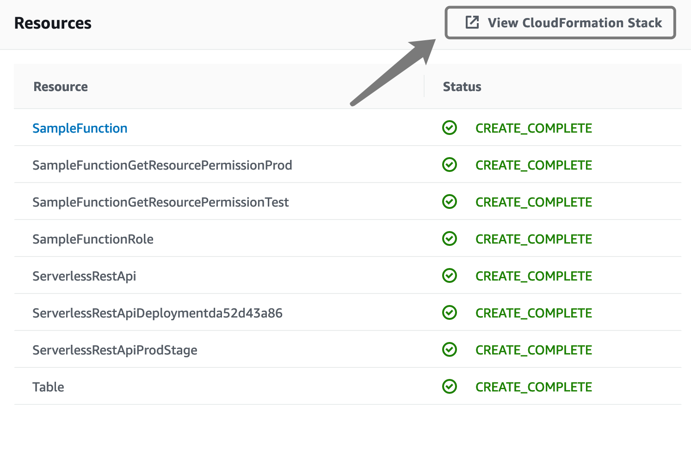
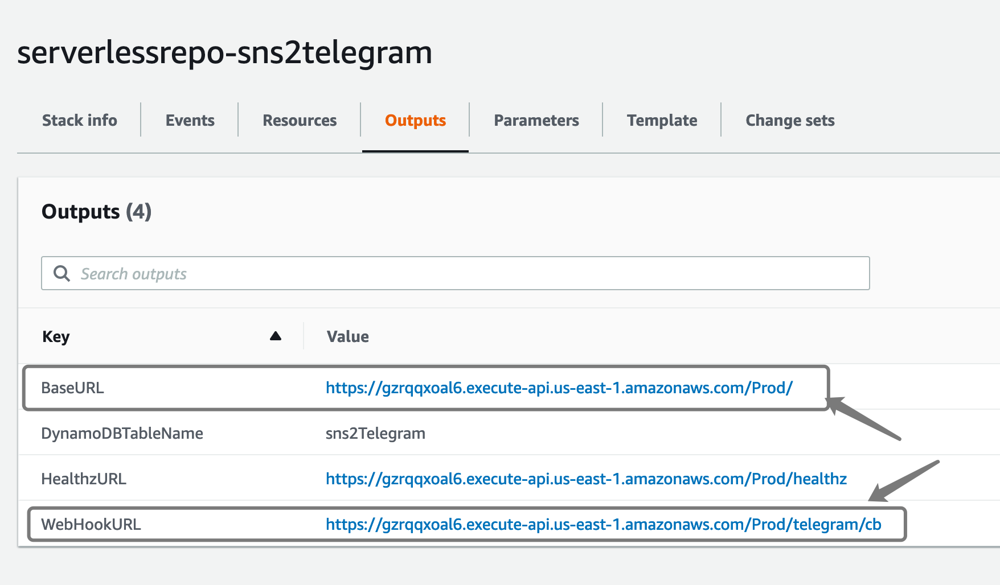
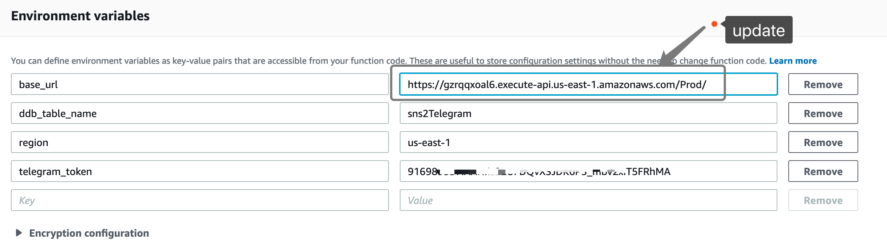
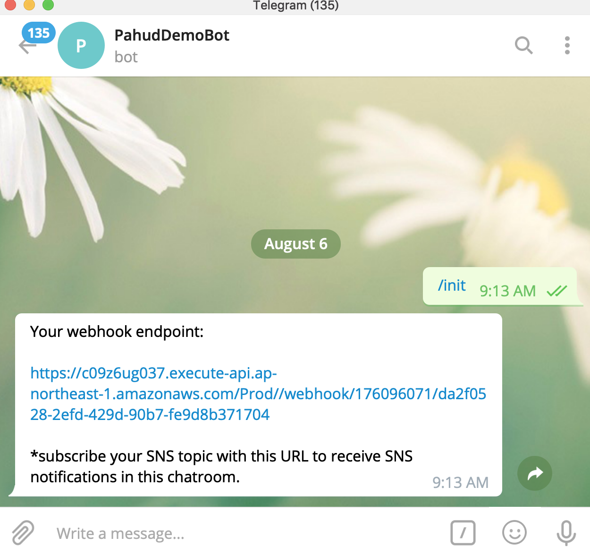
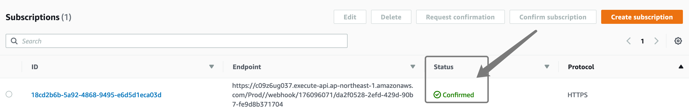

# sns2telegram

[](https://serverlessrepo.aws.amazon.com/#/applications/arn:aws:serverlessrepo:us-east-1:903779448426:applications~sns2telegram)

**sns2telegram** is a serverless message gateway built with Amazon API Gateway and AWS Lambda which forwards your incoming Amazon SNS messages to your Telegram client. This application is currently hosted in **AWS SAR(Serverless App Repository)** and we can easily deploy this serverless application by simply clicking **Deploy** from SAR.


# Prerequisities

1. new a bot from [botfather](http://t.me/botfather) in Telegram with **/newbot** command
2. copy the **Access Token**





Click and deploy **sns2telegram** from SAR to your AWS region


|        Region        |                    Click and Deploy                     |
| :----------------: | :----------------------------------------------------------: |
|  **ap-northeast-1**  |[](https://deploy.serverlessrepo.app/ap-northeast-1/?app=arn:aws:serverlessrepo:us-east-1:903779448426:applications/sns2telegram)|
|  **ap-northeast-2**  |[](https://deploy.serverlessrepo.app/ap-northeast-2/?app=arn:aws:serverlessrepo:us-east-1:903779448426:applications/sns2telegram)|
|  **ap-northeast-3**  |[](https://deploy.serverlessrepo.app/ap-northeast-3/?app=arn:aws:serverlessrepo:us-east-1:903779448426:applications/sns2telegram)|
|  **ap-south-1**  |[](https://deploy.serverlessrepo.app/ap-south-1/?app=arn:aws:serverlessrepo:us-east-1:903779448426:applications/sns2telegram)|
|  **ap-southeast-1**  |[](https://deploy.serverlessrepo.app/ap-southeast-1/?app=arn:aws:serverlessrepo:us-east-1:903779448426:applications/sns2telegram)|
|  **ap-southeast-2**  |[](https://deploy.serverlessrepo.app/ap-southeast-2/?app=arn:aws:serverlessrepo:us-east-1:903779448426:applications/sns2telegram)|
|  **ca-central-1**  |[](https://deploy.serverlessrepo.app/ca-central-1/?app=arn:aws:serverlessrepo:us-east-1:903779448426:applications/sns2telegram)|
|  **eu-central-1**  |[](https://deploy.serverlessrepo.app/eu-central-1/?app=arn:aws:serverlessrepo:us-east-1:903779448426:applications/sns2telegram)|
|  **eu-north-1**  |[](https://deploy.serverlessrepo.app/eu-north-1/?app=arn:aws:serverlessrepo:us-east-1:903779448426:applications/sns2telegram)|
|  **eu-west-1**  |[](https://deploy.serverlessrepo.app/eu-west-1/?app=arn:aws:serverlessrepo:us-east-1:903779448426:applications/sns2telegram)|
|  **eu-west-2**  |[](https://deploy.serverlessrepo.app/eu-west-2/?app=arn:aws:serverlessrepo:us-east-1:903779448426:applications/sns2telegram)|
|  **eu-west-3**  |[](https://deploy.serverlessrepo.app/eu-west-3/?app=arn:aws:serverlessrepo:us-east-1:903779448426:applications/sns2telegram)|
|  **sa-east-1**  |[](https://deploy.serverlessrepo.app/sa-east-1/?app=arn:aws:serverlessrepo:us-east-1:903779448426:applications/sns2telegram)|
|  **us-east-1**  |[](https://deploy.serverlessrepo.app/us-east-1/?app=arn:aws:serverlessrepo:us-east-1:903779448426:applications/sns2telegram)|
|  **us-east-2**  |[](https://deploy.serverlessrepo.app/us-east-2/?app=arn:aws:serverlessrepo:us-east-1:903779448426:applications/sns2telegram)|
|  **us-west-1**  |[](https://deploy.serverlessrepo.app/us-west-1/?app=arn:aws:serverlessrepo:us-east-1:903779448426:applications/sns2telegram)|
|  **us-west-2**  |[](https://deploy.serverlessrepo.app/us-west-2/?app=arn:aws:serverlessrepo:us-east-1:903779448426:applications/sns2telegram)|

In the `Application Settings`, enter your **Access Token** in the **TelegramToken** field.

Check `I acknowledge that this app creates custom IAM roles` as this app will create a Lambda role with minimal privileges. 

Click **Deploy** and you'll see the following screen in a few seconds.



Click **View CloudFormation Stack**

Click the **Outputs** tab and copy the **BaseURL** and  **WebHookURL**.





Go to your Lambda console and search **serverlessrepo-sns2telegram-SampleFunction-{RANDOM}** function. Update the **base_url** variable with the value of **BaseURL** from last step. Scroll up and click **Save**.





OK. Our application should be all configured. Let's cURL the Telegram API to configure the webhook URL.

```bash
my_bot_token=ENTER YOUR TELEGRAM TOKEN HERE
url_to_send_updates_to=ENTER YOUR WebHookURL HERE
curl https://api.telegram.org/bot${my_bot_token}/setWebhook?url=${url_to_send_updates_to}
```

Response

```json
{"ok":true,"result":true,"description":"Webhook is already set"}
```


## Start the Chat with our Bot

Send **/init** to your bot and it returns your unique HTTPS URL. 



Copy that URL and subscribe your Amazon SNS topic as **HTTPS** protocol. Paste this URL as the **Endpoint**. 


Your Telegram will immediately receive a confirmation URL. You don't need to click that URL because Telegram client will try open this URL for preview and this will confirm the subscription for us.





## Test and Validation

OK now you are all set. All messages sending to this SNS topic will forward to your Telegram now.

```bash
$ aws sns publish --message '{"foo":"bar"}' --topic-arn arn:aws:sns:ap-northeast-1:903779448426:sns2telegram
{
    "MessageId": "9f86b456-f4ef-59f0-98f7-e1942f6140a7"
}
```

And you receive this message in Telegram immediately:

```json
{
   "Message": {
      "foo": "bar"
   },
   "MessageId": "9f86b456-f4ef-59f0-98f7-e1942f6140a7",
   "Timestamp": "2019-08-06T01:35:10.734Z",
   "TopicArn": "arn:aws:sns:ap-northeast-1:903779448426:sns2telegram",
   "Type": "Notification"
}
```


## Clean up

To clean up this application, just delete the **serverlessrepo-sns2telegram** cloudformation stack and  remove your SNS subscriptions.


# FAQ

### Does sns2telegram support cross-region SNS messages?

Yes, you can deploy your sns2telegram stack in one region with SNS topics in other regions.